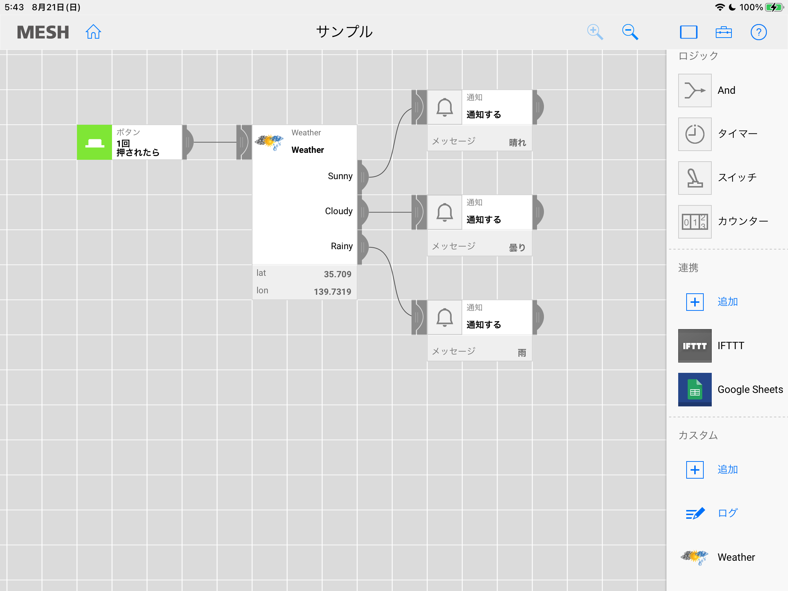
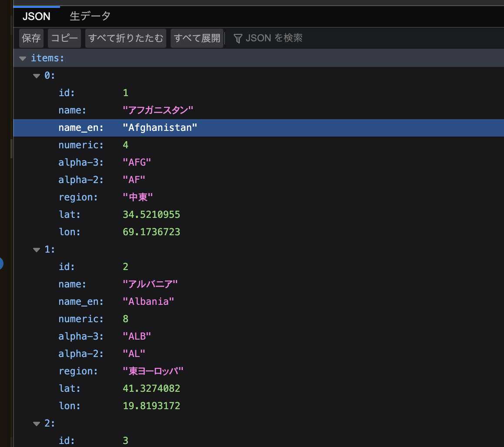
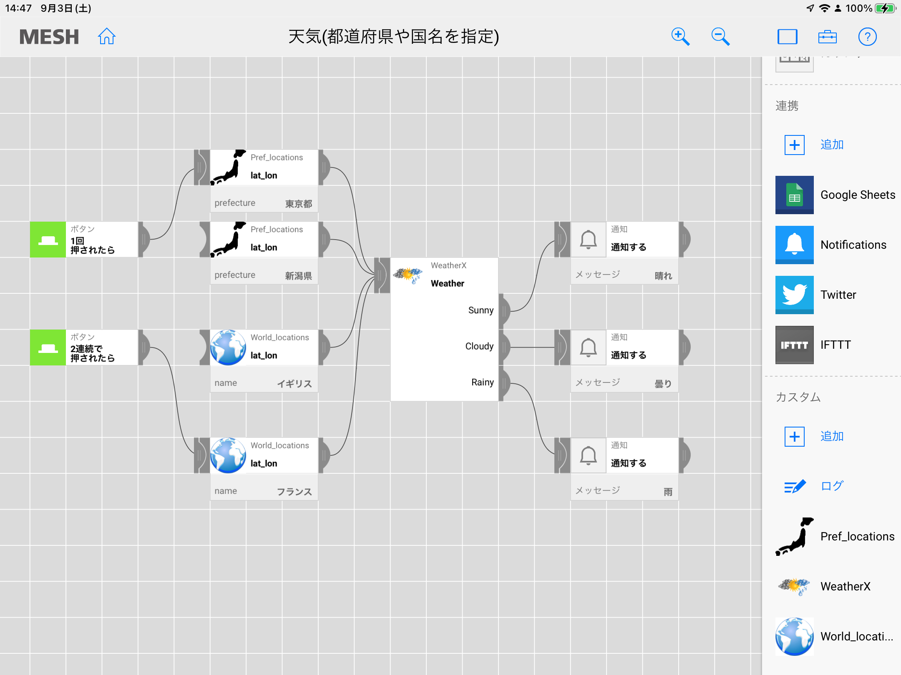
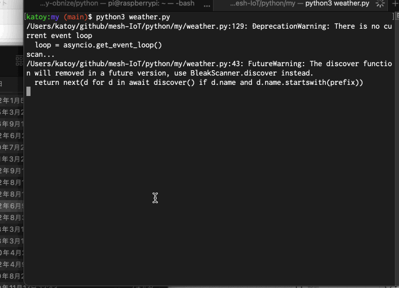
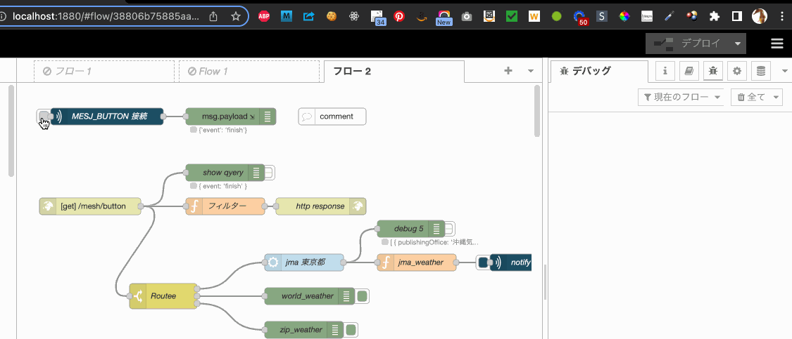

# MESH で IoT

Mesh を色々 試していきます。

## 天気予報

<https://support.meshprj.com/hc/ja/articles/212118588-SDK%E3%81%A7%E3%81%AE%E4%BD%9C%E4%BE%8B%E3%82%92%E6%95%99%E3%81%88%E3%81%A6%E3%81%8F%E3%81%A0%E3%81%95%E3%81%84>
 MESH SDKの説明にある "天気予報ブロック" を変更してみました。

### 変更点

- カスタムブロックのイメージ画像
- パラメータを location (名前) -> log, lat (緯度、軽度)

緯度、軽度は google マップで簡単に調べることが可能です。

- <https://pc-chain.com/sns/google-map-get-coordinates/>
- 【Googleマップ】緯度・経度（座標）を表示する

### 使い方

SDK の作成画面で, cusptoms/weather.json  を読み込みます。
その後、code- execute スクリプト中の APPID を open-weather サイトで取得した 値に編集して save します)

(あらかじめ、json 中の APPID を テキストエディタで (open-weather の appid の値に編集してから、読み込んでも良いです)

MESH のレシピ作成画面で、カスタムブロック weather を取り込みます。
weather を編集画面にドラッグして、Mesh のブロックと繋げていきます。



## 県名から緯度軽度を絵右葉にする

緯度軽度を手で記入するのは、やはり面倒。
そこで、県名から緯度軽度を求めるカスタムブロックを作ることにした。

県庁所在地の緯度軽度を google スプレッドシートで管理する。

カスタムブロックから google スプレッドシートの内容を取得するのに、
sssapi を使うことにした。

pref_locations と、weatherx の２つのブロックを作る。

pref_locations の画像は <https://www.pngfind.com/download/hJJoxi_png-file-svg-japan-map-icon-png-transparent/>

スプロッドシートは <https://docs.google.com/spreadsheets/d/1Q4hJxEfK5HsH-JNW9zqgOwTiQk1uR-2XK9O-rbJFI8I/edit#gid=0>

ssapi の URL は <https://api.sssapi.app/ouZltg7fT2t9kbyodTQZ3>

### sssapi のフィルタ機能も利用

ssapi の url に query string を指定して、絞り込みをさせることが可能。

例：
<https://api.sssapi.app/ouZltg7fT2t9kbyodTQZ3?filter__pref_name__startswith=東京>

これを使えば、カスタムブロック中で目的の列を探すループ処理をなくすことができる。

## 世界の首都の天気

次に世界の首都の天気を得ることを目指す。

首都の緯度軽度の csv を作成し、sssapi でアクセスするようにすれば済むと思った。

世界の首都も緯度軽度のデータは以下にあった。
<https://landwatch.info/topic/country-code/>

これをもとに google drive 上にスプレッドシートを作成した。
<https://docs.google.com/spreadsheets/d/1M5m1UKmcdIThzmZqf4uRTC4ug08YQhAHKjAlfruO_Eo/edit#gid=0>

これを sssapi でアクセスできるようにしてみた.
しかし sssapi のフリープランでは 50行までのデータしか返ってこなかった。
(有料プランに切り替えて解決させても良いのだが。)

そこで  GAS (Goola App Script) を使って、スプレッドシート内容を json で得ることにした。

以下のようなスクリプトを作成し、web アプリとして deploy する。

```javascript
function doGet(request) {
  var func = 'jsondata';
  var data = getData('https://docs.google.com/spreadsheets/d/1M5m1UKmcdIThzmZqf4uRTC4ug08YQhAHKjAlfruO_Eo/edit#gid=0', 'locations');
  const json = JSON.stringify({"items": data}, null, 2);
  const type = ContentService.MimeType.JSON;
  return ContentService.createTextOutput(json).setMimeType(type);

  //return ContentService.createTextOutput(func + '(' + JSON.stringify(data, null, 2) + ')')
  // .setMimeType(ContentService.MimeType.JAVASCRIPT);
}

function getData(url, sheetName) {
  var sheet = SpreadsheetApp.openByUrl(url).getSheetByName(sheetName);
  var rows = sheet.getDataRange().getValues();
  var keys = rows.splice(0, 1)[0];
  return rows.map(function(row) {
    var obj = {}
    row.map(function(item, index) {
      obj[keys[index]] = item;
    });
    return obj;
  });
}
```
URL <https://script.googleusercontent.com/macros/echo?user_content_key=AIwSd7MOUkL_HxETZkkmlWgYHgC27RCXFGMHFAoPzV0f8fJ8gxXnHl7PxbyL4D9d5fE9JX8FRvVLBubV50Fm8D70E5drpfnOm5_BxDlH2jW0nuo2oDemN9CCS2h10ox_1xSncGQajx_ryfhECjZEnN90nsjJIiFUpyjnds0au3ZyaHzh03aEVln1wmCgEfC5ay1AuBOaPnWf8CI1TK1FI6QKDKw6FNu7tRDoMU0Y9RLbw57a0FTp3Q&lib=M19gLnhxrHV5mXHDszaGeDx1YIjfDoZNP>
にブラウザでアクセスすると json 形式でスプレッドーシートの内容を取得できた。



MESH のレシピとして次のように組み立てた。



カスタムブロックの内容は ./cusmss 以下にある *.json を impot して作成できる。
(APIKEY の部分は適宜編集をする事)

天気レシピの内容は、./recipes 以下にある *.mesh を import して作成できる。

## python でレシピと同等の動作を実装

Mesh との通信が python でできるようになった。

上で作ったレシピと同様に動作をするものを python で作ってみた。(MacOS 上で)



プログラムコード中の OpenWeather の APIKEy や IFTTT で Slack に投稿をするための URL は 敵技設定した上でコード中に記載をする必要がある。

* Mesh の ボタンデバイスの電源を入れておく。
* puthon3 weather.py とすて起動する。
* 数秒すると、connected の表示が出る。
* ボタンを押す。
* Mac の画面に 天気が通知される。
* IFTTT で設定したアクションで Slack 通知をするようにしていたなら、Slack へも天気が通知される。
## node-red でレシピと同等の動作を実装

作業途中...

- node-red/flows.json
- node-red/python/*.py

